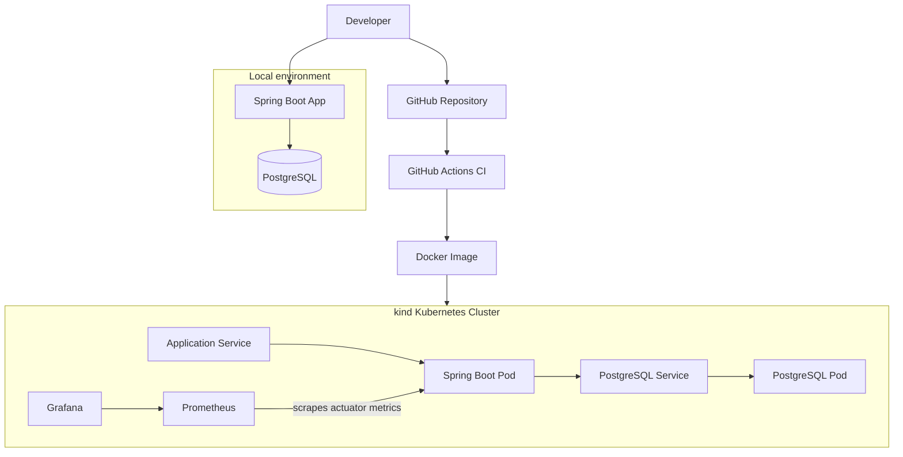
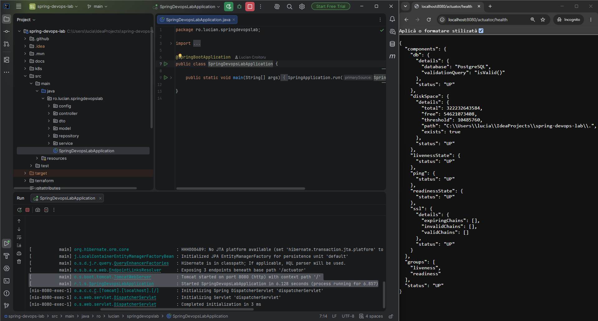
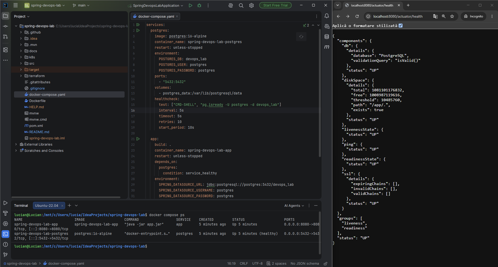
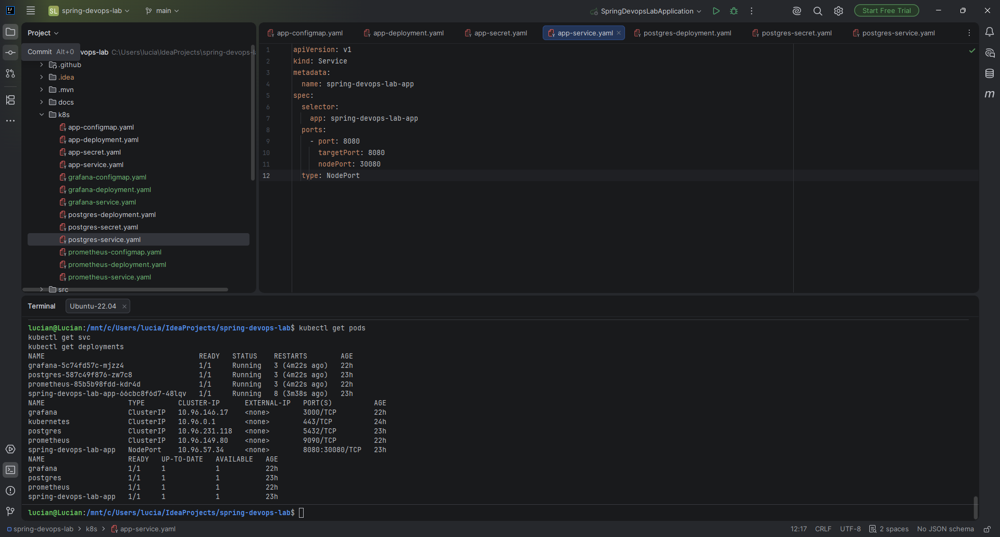
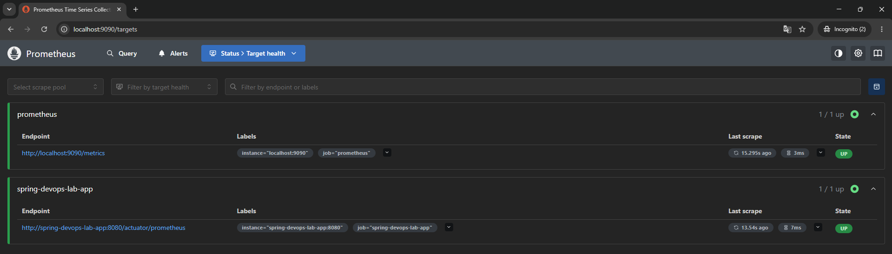
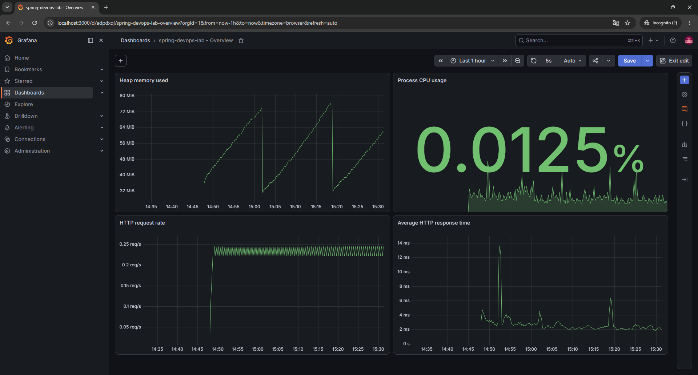

# spring-devops-lab

[](https://openjdk.org/)
[](https://spring.io/projects/spring-boot)
[](https://www.postgresql.org/)
[](https://www.docker.com/)
[](https://kind.sigs.k8s.io/)
[](https://github.com/LucianDanielCroitoru/spring-devops-lab/actions/workflows/ci.yml)

Small end-to-end DevOps portfolio project built around a Spring Boot task management application and PostgreSQL.

The purpose of this repository is to show a practical delivery flow from local development to containerization, CI, Kubernetes deployment on kind, basic monitoring, and Terraform-based infrastructure management.

## Overview

This project demonstrates:

- local application startup
- PostgreSQL integration
- Docker image build
- Docker Compose orchestration
- GitHub Actions CI
- Kubernetes deployment on kind
- Prometheus and Grafana monitoring
- Terraform-based infrastructure management

## Features

The application exposes a simple task management API built with Spring Boot.

Main application layers included in the project:

- REST controller layer
- service layer
- repository layer
- DTOs for create and update requests
- global exception handling
- persistence with Spring Data JPA and PostgreSQL
- health and metrics endpoints with Spring Boot Actuator

## Tech stack

- Java 21
- Spring Boot
- Spring Data JPA
- Spring Boot Actuator
- PostgreSQL 16
- Docker
- Docker Compose
- GitHub Actions
- Kubernetes
- kind
- Prometheus
- Grafana
- Terraform

## Repository structure

```text
.
├── Dockerfile
├── HELP.md
├── README.md
├── docker-compose.yaml
├── k8s/
│   ├── app-configmap.yaml
│   ├── app-deployment.yaml
│   ├── app-secret.yaml
│   ├── app-service.yaml
│   ├── grafana-configmap.yaml
│   ├── grafana-deployment.yaml
│   ├── grafana-service.yaml
│   ├── postgres-deployment.yaml
│   ├── postgres-secret.yaml
│   ├── postgres-service.yaml
│   ├── prometheus-configmap.yaml
│   ├── prometheus-deployment.yaml
│   └── prometheus-service.yaml
├── src/
│   ├── main/
│   │   ├── java/ro/lucian/springdevopslab/
│   │   │   ├── config/
│   │   │   ├── controller/
│   │   │   ├── dto/
│   │   │   ├── model/
│   │   │   ├── repository/
│   │   │   └── service/
│   │   └── resources/
│   └── test/
├── terraform/
│   ├── app.tf
│   ├── main.tf
│   ├── outputs.tf
│   ├── postgres.tf
│   ├── providers.tf
│   ├── terraform.tfvars
│   └── variables.tf
├── mvnw
├── mvnw.cmd
└── pom.xml
```

## Architecture diagram



## Delivery flow

### 1. Run locally

Start the application directly with Maven:

```bash
./mvnw spring-boot:run
```

Default local URL:

```text
http://localhost:8080
```

### 2. Run with Docker Compose

Start application and database:

```bash
docker compose up --build
```

Useful endpoints:

- App: `http://localhost:8080`
- Health: `http://localhost:8080/actuator/health`
- Prometheus metrics: `http://localhost:8080/actuator/prometheus`

### 3. CI with GitHub Actions

The CI workflow validates the project on push.

Current responsibilities:

- checkout source code
- set up Java
- run Maven build and tests
- verify the application builds successfully

### 4. Deploy on Kubernetes with kind

Create the cluster:

```bash
kind create cluster --name spring-devops-lab
```

Build the Docker image:

```bash
docker build -t spring-devops-lab-app:latest .
```

Load the image into kind:

```bash
kind load docker-image spring-devops-lab-app:latest --name spring-devops-lab
```

Apply Kubernetes manifests:

```bash
kubectl apply -f k8s/
```

Verify resources:

```bash
kubectl get pods
kubectl get svc
kubectl get deployments
```

Access the application, depending on your chosen service setup, either through port-forwarding or through the configured local exposure.

### 5. Monitoring with Prometheus and Grafana

The `k8s/` folder also contains manifests for:

- Prometheus `ConfigMap`, `Deployment`, and `Service`
- Grafana `ConfigMap`, `Deployment`, and `Service`

The application exposes these useful Actuator endpoints:

- `/actuator/health`
- `/actuator/health/liveness`
- `/actuator/health/readiness`
- `/actuator/prometheus`

### 6. Provision with Terraform

From the `terraform/` folder:

```bash
terraform init
terraform validate
terraform apply
```

Terraform files included in the project:

- `providers.tf`
- `variables.tf`
- `main.tf`
- `app.tf`
- `postgres.tf`
- `outputs.tf`

## Kubernetes resources

The `k8s/` folder contains manifests for:

- application `ConfigMap`
- application `Secret`
- application `Deployment`
- application `Service`
- PostgreSQL `Secret`
- PostgreSQL `Deployment`
- PostgreSQL `Service`
- Prometheus `ConfigMap`
- Prometheus `Deployment`
- Prometheus `Service`
- Grafana `ConfigMap`
- Grafana `Deployment`
- Grafana `Service`

## Configuration

The application reads database settings from environment variables:

- `SPRING_DATASOURCE_URL`
- `SPRING_DATASOURCE_USERNAME`
- `SPRING_DATASOURCE_PASSWORD`

This keeps the application portable across local development, Docker Compose, and Kubernetes.

## Screenshots

```md

### Local run


### Docker Compose


### Kubernetes pods


### Prometheus targets


### Grafana dashboard

```

## Troubleshooting

### Port already in use

If local port `8080` is already occupied, stop the existing process or use a different local mapping.

### Image updated but pod still uses old version

Rebuild and reload the image into kind, then restart the deployment:

```bash
docker build -t spring-devops-lab-app:latest .
kind load docker-image spring-devops-lab-app:latest --name spring-devops-lab
kubectl rollout restart deployment/spring-devops-lab-app
```

### Check pod logs

```bash
kubectl logs deployment/spring-devops-lab-app
kubectl logs deployment/postgres
```

## Roadmap

- [x] Run application locally
- [x] Run application with PostgreSQL
- [x] Dockerize the application
- [x] Add GitHub Actions CI
- [x] Deploy on Kubernetes with kind
- [x] Add monitoring with Prometheus and Grafana
- [x] Add Terraform
- [x] Add architecture diagram and screenshots

## Notes

`HELP.md` is kept as the default Spring Boot helper file.

`README.md` is the main portfolio-oriented documentation for this repository.